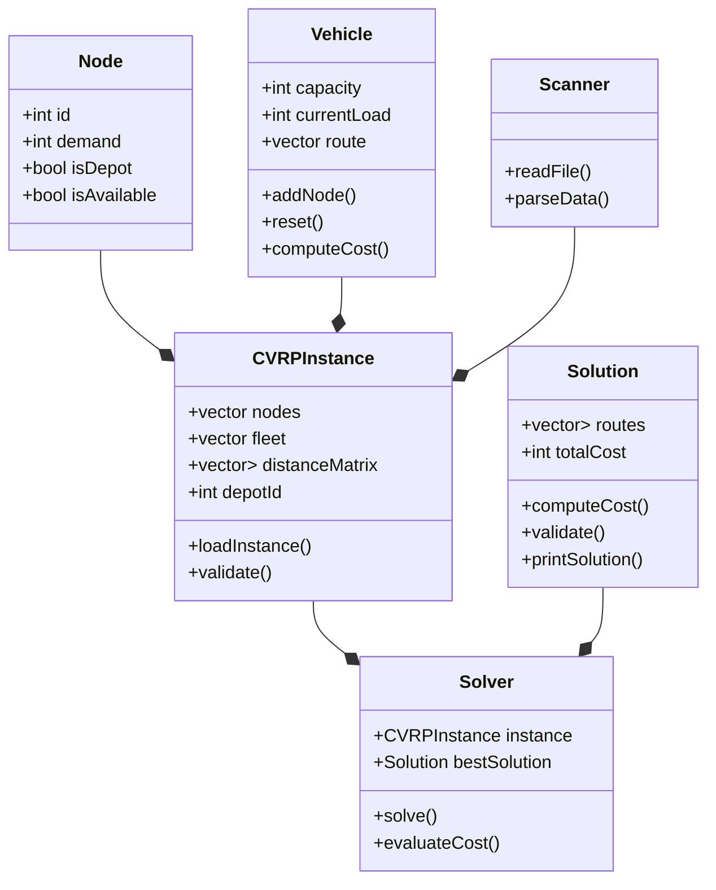

# 🚛 Capacitated Vehicle Routing Problem
# 💪 A Brute Force Approach

This repository contains an implementation of a brute-force algorithm to solve the **Capacitated Vehicle Routing Problem (CVRP)**.  
The CVRP is a classic optimization problem that focuses on determining the most efficient routes for a fleet of vehicles 🚐 with limited capacity to deliver goods 📦 to a set of customers.

## ✨ Features
- 🧠 **Exhaustive Search**: Explore all possible solutions to find the optimal routes.
- 🛠️ **Customizable Inputs**: Configure vehicle capacities and customer demands.
- 📊 **Visualization**: Analyze routes and performance metrics.
- 🎓 **Educational Focus**: Ideal for small-scale problems and learning purposes.

## 🚀 Use Cases
This repository is perfect for:
- 📚 Gaining insights into the CVRP and brute-force techniques.
- 🔍 Comparing brute-force solutions with heuristics or metaheuristics.
- 🧪 Experimenting with optimization on small problem instances.

## 🏗 Project Structure
```
CapacitatedVehicleRoutingProblem-BruteForce/
│── Benchmarks/     # Contains benchmark problem instances and solutions
│── src/           # Source code of the project
│── Makefile       # Build automation file
│── README.md      # Project documentation
```

## 🛠️ Compilation and Execution
This project uses a `Makefile` for easy compilation. To build the project, navigate to the repository root and run:
```
make
```
This will generate an executable file. To run the program, use:
```
./cvrp_solver input_file.vrp
```
where `input_file.vrp` is a valid CVRP instance file from the `Benchmarks/` directory.

## 📌 Example Usage
```
./cvrp_solver Benchmarks/A/A-n32-k5.vrp
```
This will process the problem instance and output the optimal solution found by the brute-force algorithm.

## 📊 Class Diagram Overview

# 📋 Table

| Classe            | Atributos Principais                                      | Métodos Principais                         |
|------------------|----------------------------------------------------------|-------------------------------------------|
| **Node**        | `int id`, `int demand`, `bool isDepot`, `bool isAvailable` | `+ Constructor()`                        |
| **Vehicle**     | `int capacity`, `int currentLoad`, `vector<int> route`    | `+ addNode()`, `+ reset()`, `+ computeCost()` |
| **CVRPInstance**| `vector<Node> nodes`, `vector<Vehicle> fleet`, `vector<vector<int>> distanceMatrix`, `int depotId` | `+ loadInstance()`, `+ validate()` |
| **Solution**    | `vector<vector<int>> routes`, `int totalCost`             | `+ computeCost()`, `+ validate()`, `+ printSolution()` |
| **Solver**      | `CVRPInstance instance`, `Solution bestSolution`          | `+ solve()`, `+ evaluateCost()`          |
| **Scanner**     | N/A                                                       | `+ readFile()`, `+ parseData()`          |


---
# 📂 Diagram


---

Feel free to explore, experiment, and optimize! 🧩 Let me know if you'd like to add more features or examples.  

